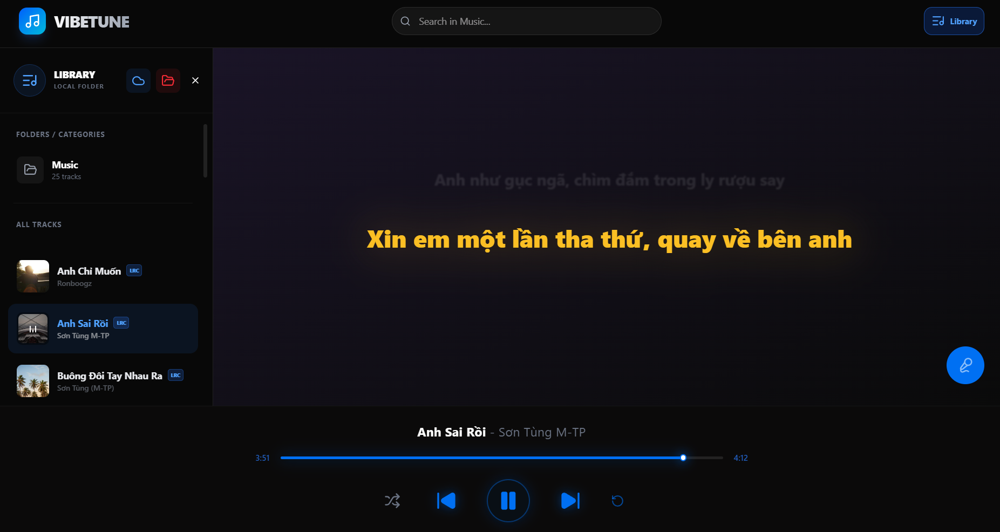

# VibeTune 🎵

Music player (React + Express) hỗ trợ:
- Google Drive
- Local files
- Lyrics sync

## Demo
https://vibetune.onrender.com

## Tech stack
- React + TypeScript
- Express + Node.js
- Tailwind CSS
- music-metadata-browser (Metadata parsing)

## Installation

### Cài đặt dependencies
```bash
npm install
```

### Chạy Development
```bash
npm run dev
```

### Build & Chạy Production
```bash
npm run build
npm start
```

## Environment Variables
Tạo file `.env` ở thư mục gốc (hoặc config trên Render):
```env
GOOGLE_CLIENT_ID=your_client_id
GOOGLE_CLIENT_SECRET=your_client_secret
PORT=3000
NODE_ENV=production
```

### Google OAuth Setup
Trong Google Cloud Console, bạn CẦN thêm các URL sau vào **Authorized redirect URIs**:
- `http://localhost:3000/auth/callback` (cho local)
- `https://vibetune-hywq.onrender.com/auth/callback` (cho Render)

## Features
- Play music từ Google Drive trực tiếp (không cần tải về)
- Seek mượt mà với hỗ trợ Range Request (HTTP 206)
- Tự động lấy Lyrics từ LRCLIB dựa trên metadata của file
- Hỗ trợ chọn Folder nhạc địa phương và đọc tag Title/Artists từ file MP3

## Screenshots

